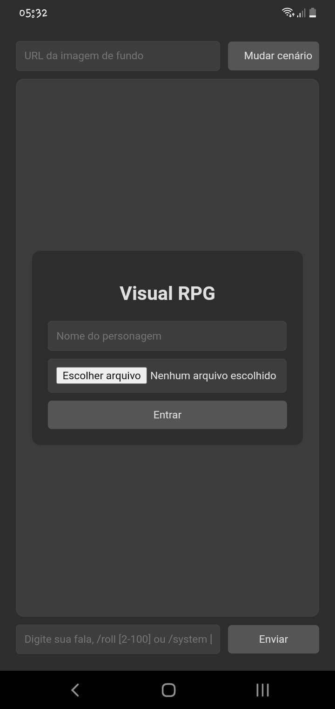

# visual-rpg-app
Chat em desenvolvimento para jogar RPGs baseados em texto.



## Instalação e inicialização
1. Baixe o flutter, abra um terminal e cole os seguintes comandos:
```
git clone https://github.com/proxlu/visual-rpg-app.git
cd visual-rpg-app
sed -i 's|https://seu-site-padrao.com|https://novo-site-do-usuario.com|' lib/main.dart
flutter doctor && flutter build apk
```
2. Seu apk estara em build/app/outputs/flutter-apk/app-release.apk
---
visual-rpg-app - by: proxlu
